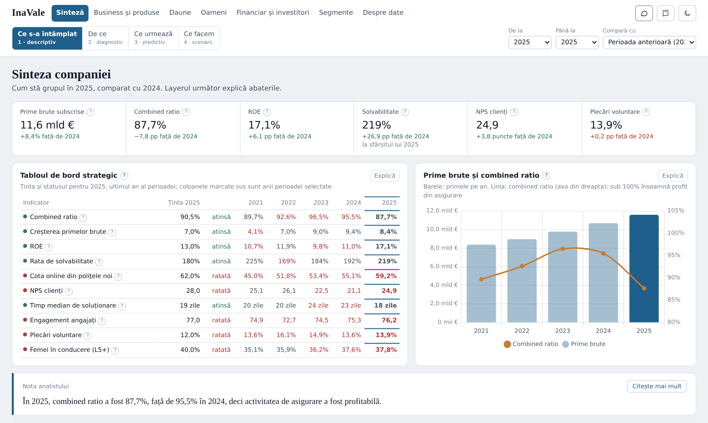

# InaVale Assurance – a multi-layer analytics dashboard

[Română](README.ro.md) · **English**

An interactive dashboard for a fictional insurance group, built as a data analysis exercise: from “what happened” to “what we do”.

**[Open the dashboard](https://[your-name].github.io/inavale-dashboard/)** · runs directly in the browser, no installation needed



---

## Why this project

I wanted to answer a practical question: what would an analytics tool look like that people in an insurance company would use day to day? Not a static report, but a tool where every figure has context (large or small compared with what?), every technical term has an explanation and every chart has a written conclusion.

I chose insurance because it is a field with specific and demanding indicators (combined ratio, loss ratio, solvency) and with “stories” that only become visible when you connect data from different parts of the company.

## What it contains

The dashboard has **6 domains** and **4 layers of depth**, that is 24 analysis screens, plus a screen that describes the data. It works in **Romanian and English**, with a language switch.

| Domain | What it analyses |
| --- | --- |
| Overview | The 10 strategic KPIs against targets |
| Business & products | Premium, policies, channels, budget, exchange-rate effect |
| Claims | Loss ratio, catastrophes, settlement time, fraud |
| People | Employees, attrition, recruitment, engagement, pay equity |
| Finance & investors | Profit, ROE, dividends, solvency, investments |
| Segments | Regions, lines of business and channels compared with each other |
| About the data | The tables, how they connect, the formulas, the limits of the data |

The 4 layers follow the maturity of data analysis:

1. **What happened** (descriptive): indicators, trends, comparisons.
2. **Why** (diagnostic): deviations, heatmaps, causes, mix analysis.
3. **What's next** (predictive): forecasts for 2026, with an uncertainty interval.
4. **What we do** (scenarios): simulators with visible assumptions that the user can change.

## The data

### Why synthetic data

An insurer's internal data (claims, salaries, results by product) is not public, and the public datasets available describe fragments of different companies. For the analyses to connect, so that attrition in the claims team shows up in settlement time and then in customer satisfaction, I needed **consistent data from one and the same company**. That is why I built a realistic synthetic dataset for a fictional company.

InaVale Assurance Group does not exist. No figure describes a real person or company.

### What the dataset contains

- **11 tables**, **59,335 rows**, **117 documented columns**
- the period **2021–2025** (60 months), **11 countries** in 4 regions, **5 lines of business**, **4 distribution channels**, **11 departments**
- amounts in EUR, with local-currency values converted at the monthly exchange rate

| Table | One row is | Rows |
| --- | --- | ---: |
| Activitate_lunara (monthly activity) | month × country × line × channel | 12,060 |
| Daune (claims) | one claim file (sample) | 25,000 |
| Angajati (employees) | one employee | 19,232 |
| Recrutare (recruitment) | quarter × department × region | 842 |
| Buget (budget) | month × region × line | 1,200 |
| Sondaje_angajati (employee surveys) | year × department × region | 220 |
| Rezultate_grup (group results) | quarter | 20 |
| Investitii (investments) | quarter × asset class | 100 |
| Tinte_strategice (strategic targets) | year × KPI | 50 |
| Cursuri_valutare (exchange rates) | month × currency | 600 |
| Tari (countries) | one country | 11 |

The table names are kept in Romanian in both languages, because they are also the sheet names in the Excel file.

### The data model

The tables are organised as a **star schema**: fact tables (measurable events) linked through five shared dimensions: time, geography, product, channel and department. In the dashboard, a “bus matrix” shows which tables can be combined and on which dimensions.

The full dataset, with a dictionary of all columns and a glossary, is in `data/InaVale_Assurance_date.xlsx` (in Romanian). The same tables are also available as CSV in `data/csv/`, so they can be browsed directly on GitHub.

### Generating and checking the data

The data was generated in Python (pandas, NumPy), with the scripts in `scripts/`, based on rules that mimic the behaviour of a real insurer: renewal seasonality, claims inflation in 2022–2023, different acquisition costs by channel, catastrophe events, and an employee population simulated month by month, with hires and leavers.

Because the data is generated, **it did not go through a cleaning stage**, as real data would have to. Instead, I ran consistency checks:

- the indicators in the targets table (the actuals) are calculated from the other tables, not entered separately;
- the hires in the recruitment table match the hires in the employees table exactly;
- the resulting values were checked for plausibility: annual combined ratio between 87% and 98%, solvency between 155% and 225%, attrition rates between 13% and 16%;
- the limits of the data are documented explicitly (the claims sample, salaries available only for 2025, channels that do not exist in certain countries);
- generation is **reproducible**: the scripts use fixed seeds for the random number generator, so running them produces exactly the same data.

## Analytical methods

**Aggregating over periods.** Indicators are aggregated differently, according to their type:
- *flows* (premium, claims, profit) are added up;
- *stocks* (employees, policies in force, solvency) are taken at the end of the period;
- *ratios* (combined ratio, loss ratio, attrition) are recalculated from the period totals, rather than averaging the annual ratios.

**Fair comparisons.** When periods of different lengths are compared (for example 2022–2025 against 2021), the dashboard compares annual averages. For multi-year ranges it also shows the compound annual growth rate (CAGR).

**Showing changes.** The same rule across the dashboard: relative percentage for amounts, percentage points (pp) for indicators expressed as percentages, points for scores, days for durations. The colour shows the effect for the company, not the direction of the figure.

**Mix analysis.** The change in the group combined ratio is split into a *rate effect* (the segments improved or deteriorated) and a *mix effect* (their weights changed):
`Δ total = Σ old weight × Δ rate + Σ Δ weight × new rate`

**Forecasts (2026).**
- Premium: linear regression on the log of monthly values, after removing seasonality, with an 80% prediction interval.
- Loss ratio: split into the *attritional loss ratio* (excluding catastrophes, predictable) and the *catastrophe load* (the multi-year average), as insurers do in planning.
- Attrition risk: a transparent rule (the weighted average of the last three years, adjusted for engagement), not a “black box” model.

**Scenarios.** Simulators for pricing (with price elasticity of demand), catastrophes and reinsurance, employee retention (cost and ROI), solvency stress tests and portfolio reallocation between segments. Every assumption is a visible slider.

## Design decisions

- **Every figure has context**: a target, a comparison period or a group average.
- **Every screen has a written conclusion** (“Analyst’s note”), calculated from the data and updated when the filters change.
- **Every technical term has an explanation**: the “?” button, a glossary for each screen and a general glossary with 89 terms.
- **Filters appear only where they apply**, so users do not look for controls that do nothing.
- **Light and dark theme.**
- **Two languages**: on the first visit, the dashboard follows the browser language (Romanian if the browser's first preferred language is Romanian, otherwise English); the RO | EN switch changes the language and the choice is remembered.
- **Adapted to any screen**: tested automatically at 7 desktop widths (1280–2560 px) and on 5 mobile devices, in both languages. On a phone, the menu becomes compact, the filters collapse into a button and the chat opens on half of the screen.

## The AI assistant

The dashboard has a chat that answers **only from InaVale's data**: it automatically receives the context of the current screen (the period, the filters, the figures in the windows) and can request additional calculations from the full dataset on its own, through functions defined in the page. The technique is called *grounding*: the answer is anchored in the data, not in the model's general knowledge.

The assistant works in the version hosted on claude.ai. In the public version here, the chat shows the suggested questions for each screen, but does not send questions.

## How it was built

- **Interface**: HTML, CSS and JavaScript, assembled into a single file, with no server; charts with [Chart.js](https://www.chartjs.org/). The English texts sit next to the Romanian ones in the code; the English glossary and data dictionary are in `src/i18n_en.json`.
- **Tests**: Playwright, on desktop and simulated mobile devices, in both languages.
- **Code style**: the JavaScript, HTML and CSS are formatted with [Prettier](https://prettier.io/) and the Python with [Black](https://black.readthedocs.io/), so the code reads consistently and can be reformatted with one command.
- **Data**: Python (pandas, NumPy), exported to Excel.
- **The role of AI.** I built the project together with **Claude (Anthropic)**, used as an assistant. [Describe here, in your own words, what you decided: for example the choice of domain, the layered structure, which indicators and analyses to include, the design requirements, checking the results.] The code and the data generation were produced with Claude's help.

## Limitations and next steps

- The data is synthetic; insurance accounting (IFRS 17) and the solvency calculation are simplified.
- Individual claims are a sample, so some figures are estimates.
- The forecasts use simple, transparent methods; a next step would be to compare them with dedicated time-series models.
- Ideas for extension: saving a “snapshot” of a screen at a given date, personal notes, a presentation mode for meetings.

## Repository structure

```
inavale-dashboard/
├── index.html                  # the complete dashboard, in a single file (data included)
├── captura.png                 # the image in this README
├── README.md                   # this file (English)
├── README.ro.md                # the Romanian version
├── .prettierrc.json            # code formatting settings (Prettier)
├── data/
│   ├── InaVale_Assurance_date.xlsx   # the dataset, with dictionary and glossary (Romanian)
│   └── csv/                          # the same tables, as CSV
├── scripts/                    # data generation, step by step
│   ├── 1_generate_business.py        # insurance activity, exchange rates
│   ├── 2_generate_claims_finance.py  # claims, budget, investments, results
│   ├── 3_generate_employees.py       # the employee population
│   ├── 4_generate_hr_kpi.py          # surveys, recruitment, strategic targets
│   ├── 5_build_excel.py              # the Excel file, with dictionary and glossary
│   ├── 6_aggregate_for_dashboard.py  # the aggregated data for the dashboard
│   ├── 7_export_csv.py
│   └── run_all.sh                    # runs all the steps
├── src/                        # the dashboard source code
│   ├── page.html                     # page structure (with placeholders for styles and scripts)
│   ├── styles.css                    # all styles: themes, layout, mobile
│   ├── 1_base.js … 6_ui_chat.js      # logic, screens, glossary, chat (texts in both languages)
│   ├── data.json                     # the aggregated data (generated by scripts/)
│   ├── i18n_en.json                  # English texts of the glossary and the data dictionary
│   ├── vendor/chart.umd.js           # Chart.js 4.4.1 (MIT licence)
│   └── build.py                      # assembles index.html
└── tests/
    └── run_tests.py            # automated display and functionality tests, in both languages
```

## How to run the project

**Just the dashboard:** download `index.html` and open it in any modern browser.

**Regenerating the data and the dashboard** (Python 3, with pandas, NumPy and openpyxl):

```bash
bash scripts/run_all.sh     # the data: Excel, CSV and src/data.json
python3 src/build.py        # the dashboard: index.html
```

**Formatting the code** (after a change; Node.js for Prettier, Python for Black):

```bash
npx prettier --write "src/*.js" src/page.html src/styles.css src/i18n_en.json
black src/build.py tests/run_tests.py scripts/*.py
```

**Automated tests** (Playwright):

```bash
pip install playwright && python -m playwright install chromium
python3 tests/run_tests.py
```

The tests go through all 25 screens at 7 desktop widths and on 5 mobile devices, once in Romanian and once in English, checking that there are no errors, no horizontal scrolling, no windows or charts that are too narrow and no figures cut off. They also check the chat in both modes, the language choice, and that no Romanian text is left in the English interface.

## Author

**[Your name]** · [LinkedIn] · [email]

Project created in 2026 as a data analysis exercise.
